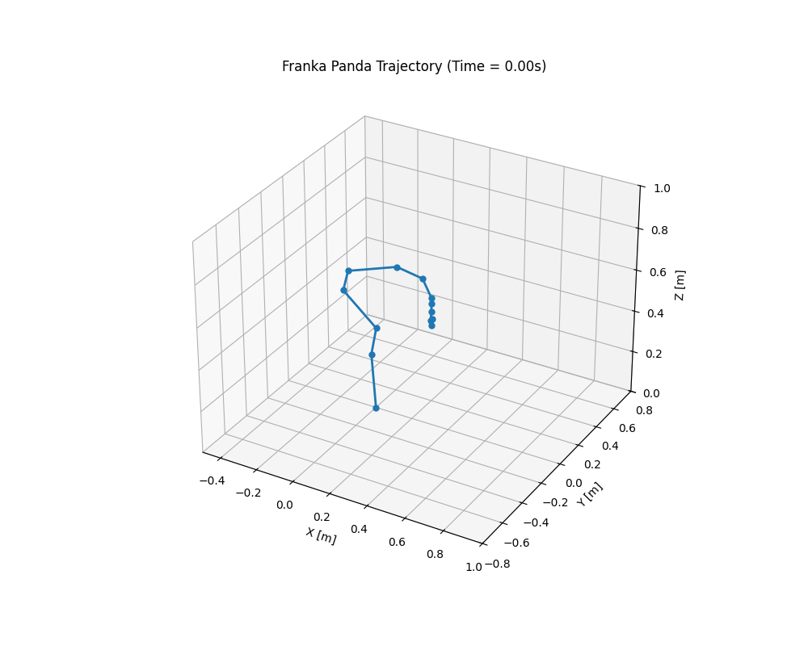
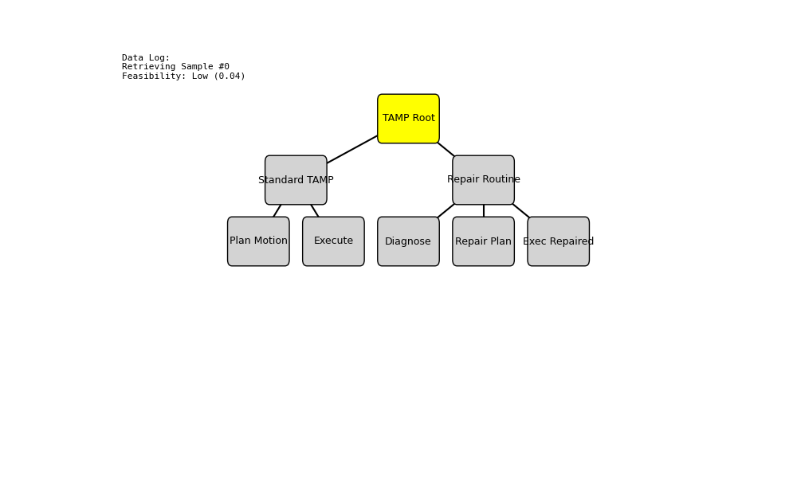
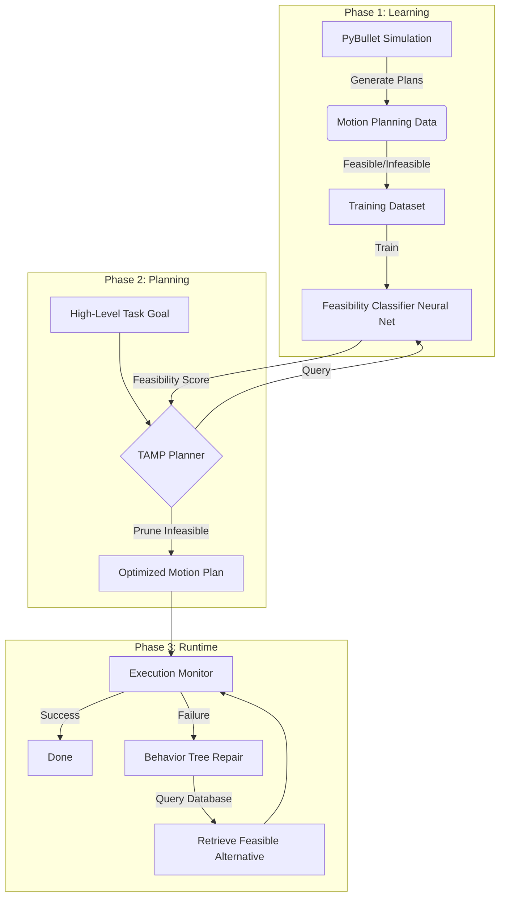

# Learning Feasibility Heuristics for Task and Motion Planning (TAMP)

A machine learning framework to accelerate Task and Motion Planning by predicting motion plan feasibility. This project integrates **PyBullet** simulation, **PyTorch** learning models, and **Behavior Trees** for robust failure recovery.

---

## 🏗️ Project Overview

Classical TAMP is computationally expensive because it must constantly check if high-level actions (like "Place Object A on Table") are geometrically feasible. This project solves this by:
1.  **Learning Feasibility**: Training a neural network to predict if an action will succeed *before* attempting it.
2.  **Pruning Search Space**: Using the model to discard infeasible actions early.
3.  **Repairing Plans**: Using a Behavior Tree to detect failures at runtime and swap in pre-calculated feasible alternatives (from a database or learned policy).

### 🎥 Demos

| **Constraint-Constrained TAMP** | **Failure Recovery (Behavior Tree)** |
| :---: | :---: |
|  |  |

---

## 🧩 System Architecture

The system operates in three main phases: **Learning**, **Planning**, and **Execution**.



### How It Works

1.  **Phase 1: Learning (Offline)**
    *   The system runs thousands of random scenarios in **PyBullet**.
    *   It records the robot state, object positions, and the target action.
    *   It attempts to find a motion plan using a classical planner (RRT*).
    *   **Successes** and **Failures** are saved to a dataset to train the neural network.

2.  **Phase 2: Planning (Online)**
    *   When given a new task, the **ML-Guided Planner** generates candidate actions.
    *   Instead of simulating every action (slow), it asks the **Feasibility Classifier**: *"Is this action likely to succeed?"*
    *   It only expends computational resources on actions with high probability of success.

3.  **Phase 3: Execution & Repair (Runtime)**
    *   The robot executes the plan.
    *   If an unexpected failure occurs (e.g., kinematic singularity), the **Behavior Tree** triggers.
    *   It diagnoses the error and "swaps in" a known feasible solution for that specific local context.

### Simulation & Data
The environment is built on **PyBullet** and leverages the `pybullet_data` library to ensure robust training.
- **Object Diversity**: Training scenes include complex mesh objects (Lego bricks, Ducks, Teddy Bears) in addition to geometric primitives, ensuring the planner learns to handle diverse collision geometries.
- **Rigorous Testing**: The system is benchmarked against randomized scenarios with high clutter and complex shapes.

### Behavior Tree Logic
The system uses a **Selector** node at the root to handle failures:
- If a plan step fails, the Selector tries alternative pre-calculated plans from a database.
- If no pre-calculated plan exists, it can trigger a re-planning phase (not yet implemented).

---

## 🚀 Quick Start

### 1. Installation
Clone the repo and install dependencies. The project requires **Python 3.8+**.

```bash
# Clone repository
git clone https://github.com/mandalfy/Feasibility_TAMP.git
cd Feasibility_TAMP

# Install requirements
pip install -r requirements.txt
python scripts/train_model.py --model mlp --epochs 50

# Run benchmark comparison
python scripts/run_benchmark.py --num_scenarios 50
```

## Project Structure

```
├── configs/           # Configuration files
├── environments/      # PyBullet simulation environment
├── data_generation/   # Motion planning & data collection
├── models/            # Neural network architectures
├── training/          # Training & evaluation code
├── planning/          # TAMP planners (baseline & ML-guided)
├── scripts/           # Entry point scripts
└── notebooks/         # Visualization & analysis
```

## Key Components

1. **Data Generation**: Collect successful/failed motion plans in PyBullet
2. **ML Classifier**: Predict feasibility from state vectors or images
3. **ML-Guided TAMP**: Prune infeasible actions before expensive planning

## License

MIT
